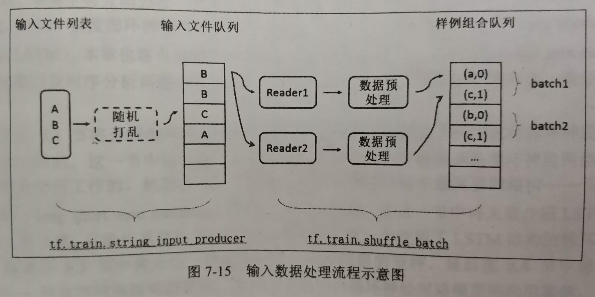

## Data
> 和数据处理相关的一切

### tensorflow 相关
> 在 `tensorflow` 文件夹中
#### 1. TFRecord输入数据格式
 * 通过tf.train.Example Protocol Buffer格式存储:  
   [example.proto](https://github.com/tensorflow/tensorflow/blob/r1.4/tensorflow/core/example/example.proto)
   [feature.proto](https://github.com/tensorflow/tensorflow/blob/r1.4/tensorflow/core/example/feature.proto)
  
 * 按照存储结构，解析数据（详见代码 `my_0_tfrecord.py`）:
    ```
    tf.train.Example(features=tf.train.Features(feature={
            "image": tf.train.Feature(bytes_list=tf.train.BytesList(value=[image]))
        })
    )
    ```
    ```
    tf.parse_single_example(example, features={
        "image": tf.FixedLenFeature([], tf.string)
    })
    ```
#### 2. TF实现图像预处理
> 详情见代码 `my_5_data_process.py`
 * 调整图片大小
    - 插值
    - 裁剪
    - 缩放
    - 填充
 
 * 图片翻转
    - 上下翻转
    - 左右翻转
    - 转置
 
 * 色彩调整
    - 亮度
    - 对比度
    - 色相
    - 饱和度
 
 * 标准化
    - 减均值/除方差

#### 3. 多线程输入数据处理框架
 
 * 为了避免图像预处理成为神经网络模型训练效率的瓶颈，
 TensorFlow提供了一套多线程处理输入数据的框架。处理流程如下：
    1. 指定原始数据的文件列表
    2. 创建文件列表队列
    3. 从文件中读取数据
    4. 数据预处理
    5. 整理成批次作为网络输入
 
 * 队列 `FIFOQueue` 和 `RandomShuffleQueue`
 * 输入文件队列 `string_input_producer`
 * 组合训练数据成batch `batch` 和 `shuffle_batch`
 
 * 总结：
    * 输入数据处理的第一步是获取存储训练数据的文件列表。
      通过`string_input_producer`可以选择性地将文件列表中的文件顺序打乱，并加入到队列中。
      `string_input_producer`会生成并维护一个队列输入文件队列，不同线程中的文件读取函数可以共享这个输入文件队列。
      在读取样例数据之后，需要将图像进行预处理。
      最后，通过`batch` 和 `shuffle_batch`将处理好的当个输入样例整理成batch提供给网络的输入层。
 
    * 通过这种方式，可以有效地提高数据预处理的效率，避免数据预处理成为整个神经网络模型训练过程中的瓶颈。
 
### 